# Flutter Mifare Classic Tool

Application build with flutter

## Project Description

* Read data from the mifare classic 1k and write on mifare ultralight and mifare classic 1k.
* App is only used for Android because mifare classic 1k tag not supported by package nfc_manager on
  iOS.

## Project Requirements and Dependencies

* NFC Permissions required in AndroidManifest.xml

  uses-permission android:name="android.permission.NFC"
  uses-permission android:name="android.permission.NFC_PREFERRED_PAYMENT_INFO"
  uses-permission android:name="android.permission.NFC_TRANSACTION_EVENT"
  uses-feature android:name="android.hardware.nfc"  android:required="true"
* nfc_manager: ^3.1.1  (https://pub.dev/packages/nfc_manager)
* See and write code in
  /android/app/src/main/kotlin/com/example/flutter_mifare_classic_tool/MainActivity.kt for check
  android device is NFC Supportable, NFC is enable from the phone and stop the mobile default NFC
  Tool which is working in background.(Call from flutter lib folder by creating method channels)

## App Screen Shot

<pre>
    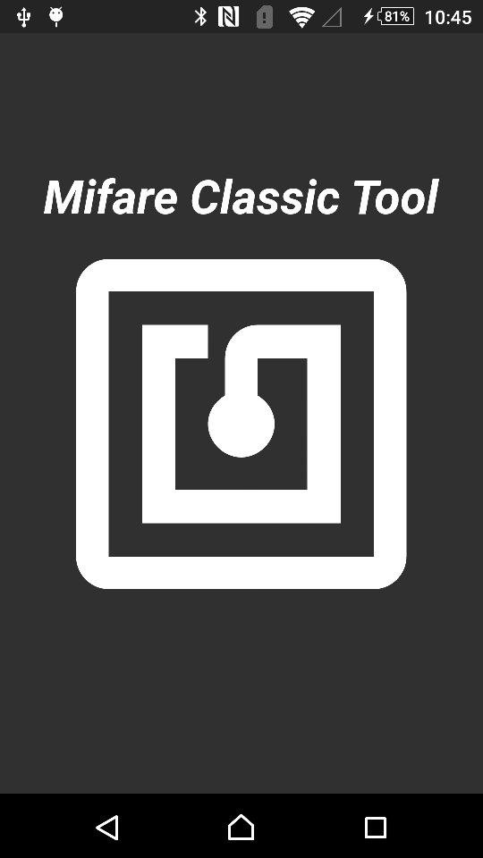 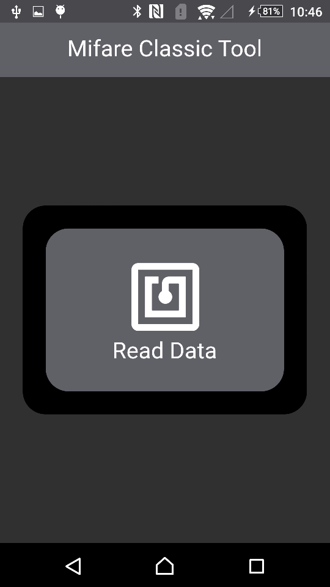 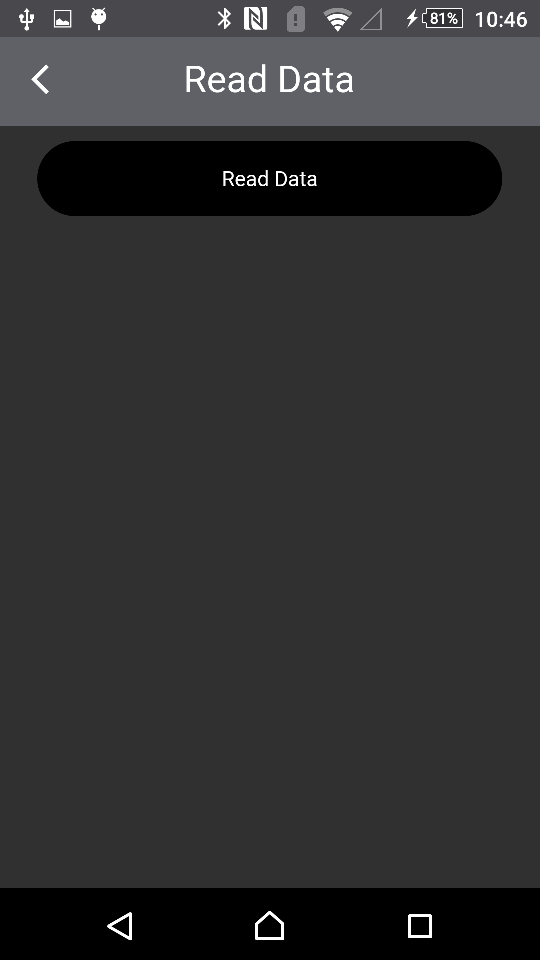
    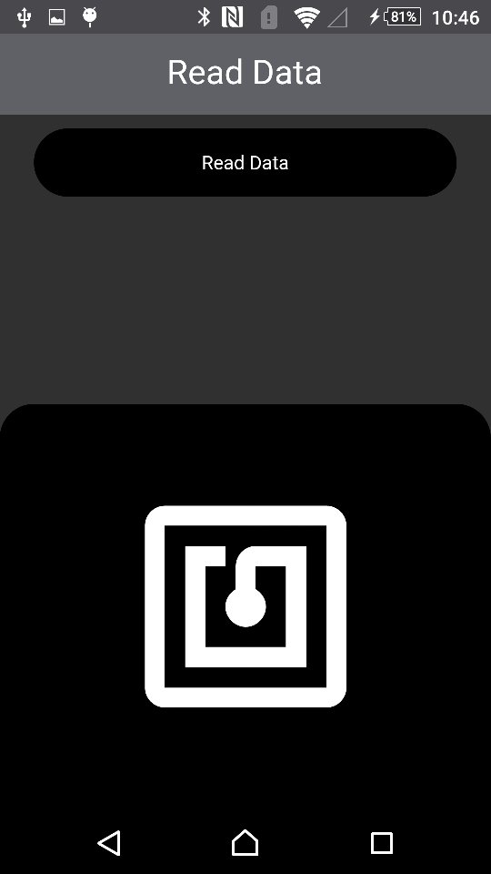 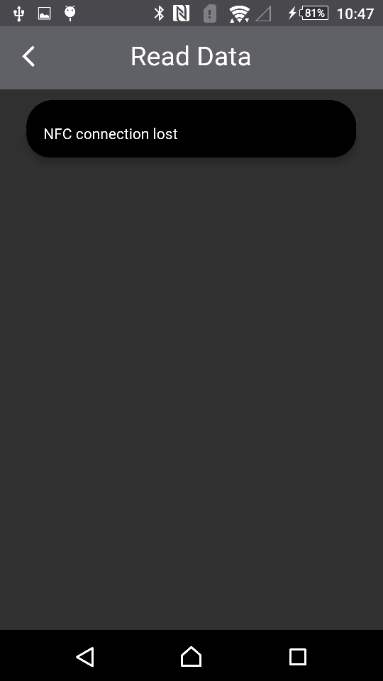  
    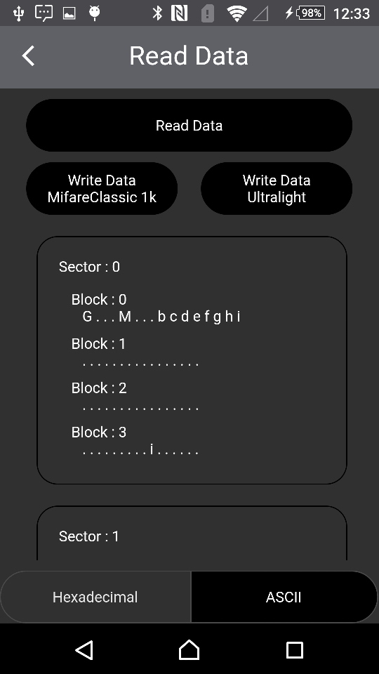 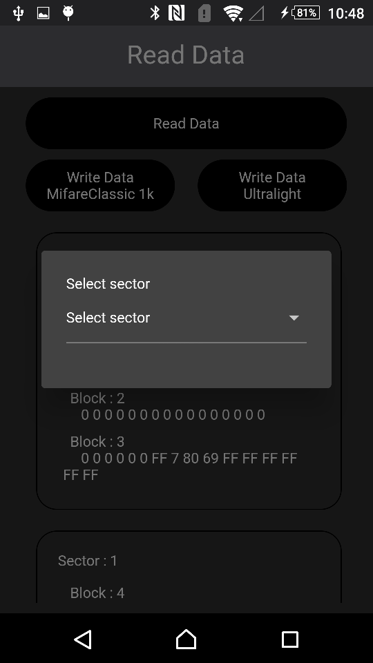 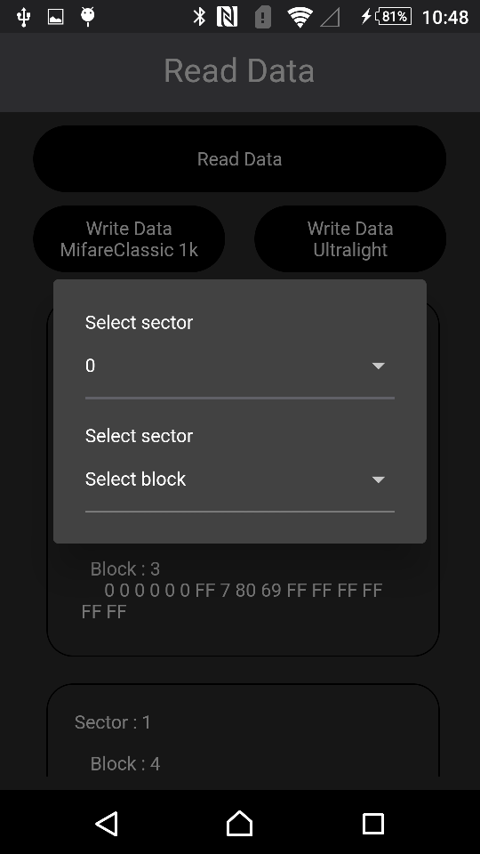 
    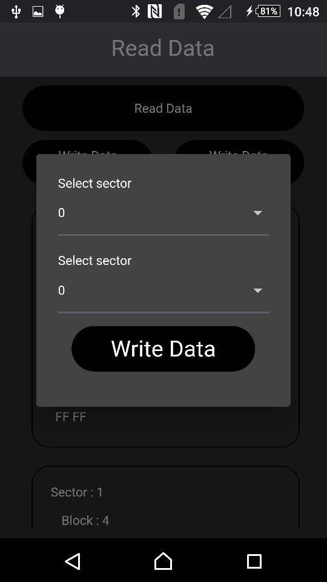  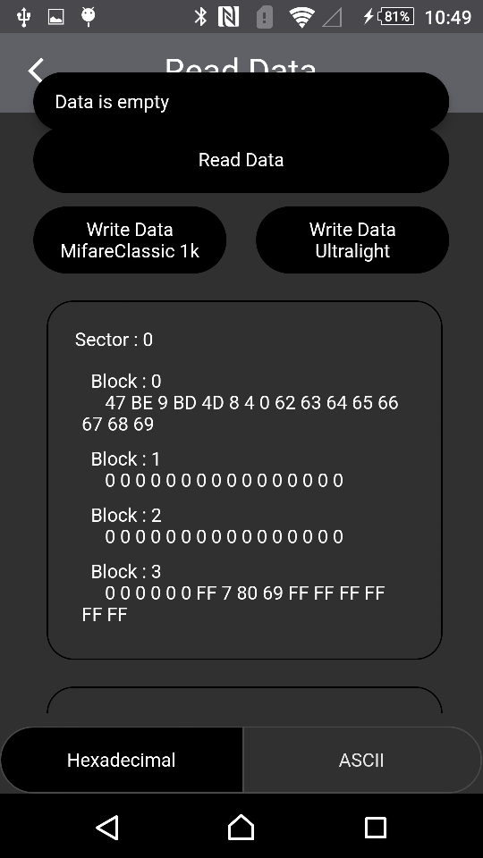 
    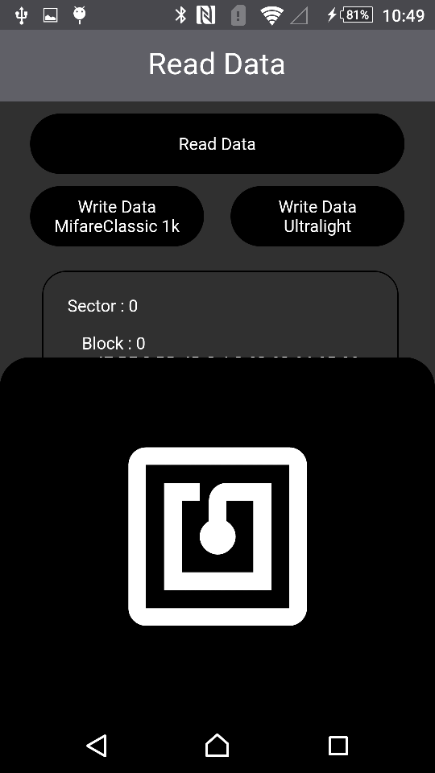  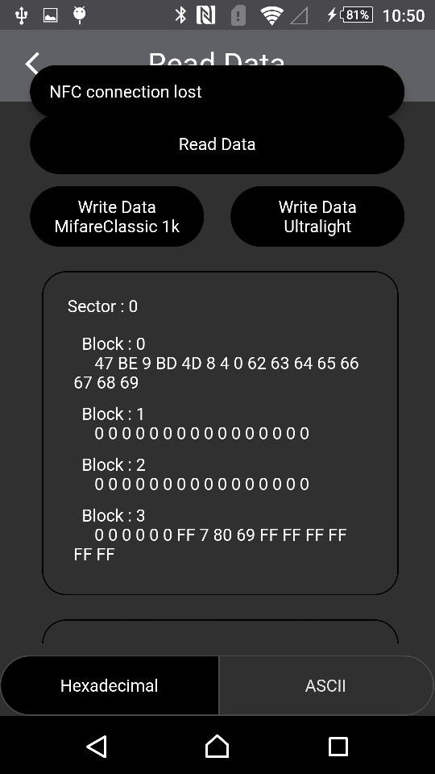
</pre>
## Getting Started
  - If you don't have Flutter SDK installed, please visit official [Flutter](https://flutter.dev/) site.
  - Fetch latest source code from master branch.
 
 ```
 git clone https://github.com/boffincoders/Flutter_MifareClassicTool.git
 ```  
 - Run the app with Android Studio or Visual Studio. Or the command line.
 
 ```
 flutter pub get
 ```
 ```
 flutter run
 ```
